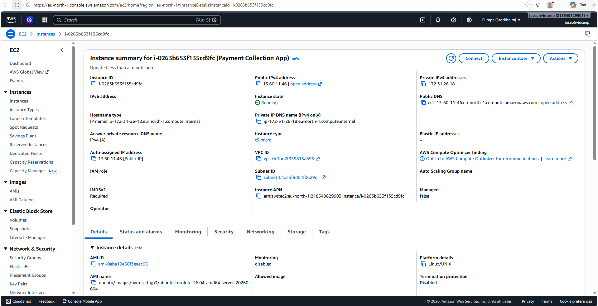
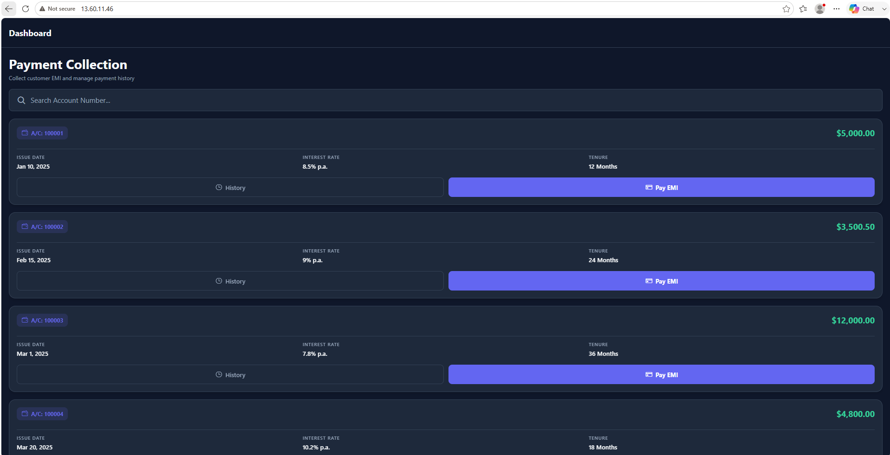
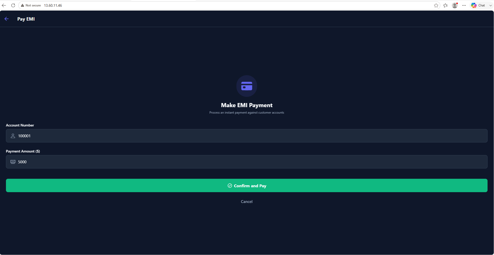
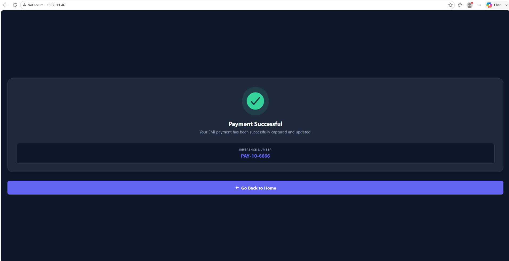

# Payment Collection App - Frontend

This is the **React Native Expo** frontend application for the Payment Collection project. It provides a responsive and intuitive user interface for customers to view loan details and pay their EMIs.

## Features
- **Responsive UI:** Works seamlessly on Android, iOS, and Web.
- **Loan Details:** Displays Account Number, Issue Date, Interest Rate, Tenure, and EMI Due.
- **Payment Processing Form:** Includes a dedicated form allowing customers to manually enter their account number, enter the EMI amount to be paid, and securely submit the payment.
- **Success Acknowledgment:** Displays a clear visual confirmation and reference number upon successful EMI payment.

---

## 1. Project Setup Steps

### Prerequisites
- Node.js (v18 or higher)
- npm or yarn
- Expo CLI

### Installation
1. Clone the repository:
   ```bash
   git clone https://github.com/josephvincenp2804/Payment-App-Frontend.git
   cd Payment-App-Frontend
   ```
2. Install the dependencies:
   ```bash
   npm install
   ```
3. Configure the environment variable:
   - Create a `.env` file in the root directory.
   - Add the backend API URL:
     ```
     EXPO_PUBLIC_API_URL=http://13.60.11.46
     ```

---

## 2. How to Run Locally

To run the application in a local development environment:
1. Start the Expo development server:
   ```bash
   npm run start
   ```
2. Choose your platform:
   - Press **`a`** to run on an Android Emulator.
   - Press **`i`** to run on an iOS Simulator.
   - Press **`w`** to open in a local Web Browser.
   - Scan the QR code with the **Expo Go** app on your physical mobile device.

---

## 3. CI/CD Pipeline Configuration

The CI/CD pipeline for this frontend is built using **GitHub Actions**. The configuration file is located at `.github/workflows/frontend.yml`.

### Pipeline Workflow:
1. **Trigger:** The pipeline automatically triggers on any `push` to the `main` branch.
2. **Environment:** Runs on an `ubuntu-latest` virtual environment.
3. **Setup Node:** Installs Node.js v18.
4. **Install Dependencies:** Runs a clean `npm ci` installation.
5. **Lint/Build Check:** Verifies the Expo codebase compiles correctly.

*(Note: Production builds for mobile apps `.apk` can be generated using EAS build as configured in `eas.json`).*

---

## 4. Deployment Steps on AWS EC2

While this repository contains the mobile source code, we use **Expo Web Export** to host the responsive web version of this app alongside the backend on AWS EC2.

1. **Launch EC2 Instance:** An Ubuntu 24.04 instance is launched on AWS.
2. **Security Groups:** HTTP (Port 80), HTTPS (Port 443), and SSH (Port 22) are opened.
3. **Build Frontend for Web:** 
   ```bash
   npx expo export -p web
   ```
4. **Nginx Reverse Proxy:** Nginx is installed on the EC2 instance to serve the static frontend files generated in the `dist` folder directly to port 80.
5. **Live URL:** The frontend is successfully accessible via the public IPv4 address: `http://13.60.11.46/`

---

## 5. Screenshots

### AWS EC2 Server


### Application UI
**Home Screen:**


**Payment Screen:**


**Success Screen:**

